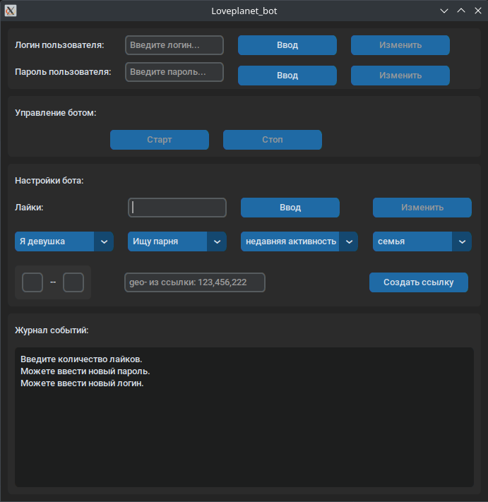

# Чат бот с БД для сайта Loveplanet.ru (демо версия)

    ! Демо версия лишь демонстрирует код графического интерфейса и структуру бота. Код самого бота скрыт, так как сделан для заказчика.

## Использовано:
    * Selenium
    * SQLAlchemy (ORM)
    * customtkinter (tkinter)

## Описание:

Бот с графическим интерфейсом осуществляет действия на сайте используя Selenium. 
Проходит аутентификацию на сайте. Переходит по сформированной в зависимости от параметров ссылке и ставит лайки или  дизлайки. При возникновении взаимной симпатии отправляет случайное сообщение из файла `mutual_like.txt`. 
Периодически проверяет поступление сообщений и отвечает в зависимости от истории сообщений, например:  
Последнее сообщение от бота было из файла `mutual_like.txt`, 
значит второе будет отправлено из `mutual_like_final.txt`, которое в свою очередь может быть закольцовано т.е. повторяться с сообщением из `reply_3.txt`, значит следущее сообщение если предусмотренно будет отправленно из `reply_4.txt`. 
Если бот еще не писал, то сообщение будет отправлено из `reply_1.txt`, и так далее, пока есть предусмотренные файлы с названием формата: `reply_{номер этапа}.txt`

**Каждый этап общения сохраняется в БД в формате:**
* Имя контакта;
* Возраст;
* Регион;
* Ссылка на профиль;
* Телефон (бот отыскивает телефон в истории сообщений);
* Переписка;
* Дата начала переписки.

## Вид интерфейса:

